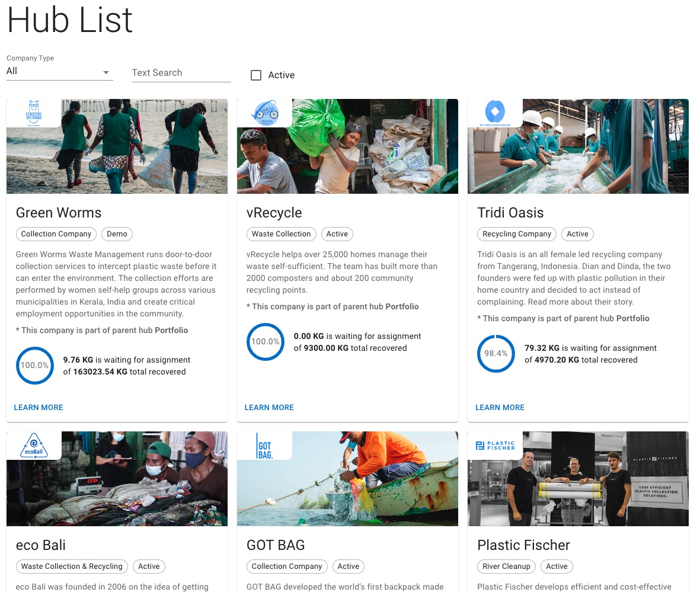

# HubLister - Berke Atac



## Installation

Install dependencies.

```bash
npm install
```

Run the application. ( Runs on port 3000 )

```bash
npm run dev
```

Run tests.

```bash
npm test
```

## Tech Stack

- TypeScript
- Vite
- React
- React Query
- Material UI
- Jest / React Testing Library
- Prettier / ESLint

## Decisions & Thoughts

- Used `React Query` for data fetching and caching. It is easy to use, and takes care of state, caching, error handling and loading states.
- Used `Material UI` for styling. It has a lot of components and can be customized easily.
- Used `memoization` techniques to prevent unnecessary re-renders, most importantly for the HubCard component that uses React.memo. This allows cards not to be re-rendered for filters state changes. This is observable through the Profiler.
- Implemented a `responsive design` using Grid, that should work on any sized screen.
- Used different sized images for logos and card media, to optimize loading times. (Although the card images could be optimized further)
- Didn't use a state management library, as the application is small and the state is not complex. (Although it could be implemented with Redux Toolkit or Context API)
- URL for the API could be stored in an environment variable, so that it could be changed easily depending on current environment. This was skipped for the sake of simplicity, during set up.
- I have added mock data and simple tests to the application. I have used `Jest` and `React Testing Library` for unit tests, and would have used `Cypress` for end-to-end tests.

## License

This project is licensed under the MIT License.
